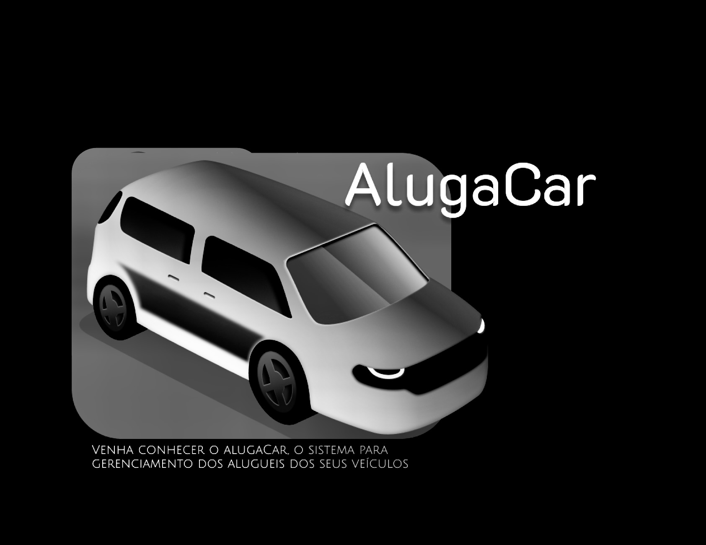

# AlugaCar - Car Rental Management

<div align="center">
  
 </div>
<div align="center">
  
  
 </div>

 
**AlugaCar** is a sophisticated application designed to simplify the car rental management process. This project is being developed with a clear focus on adopting solid software engineering principles and a well-defined architecture, inspired by the **Clean Architecture** and Clean Code guidelines. These strategic choices ensure code modularity, flexibility, and ease of maintenance, promoting effective separation between business logic, the interface layer, and infrastructure.

## Design and Architecture Principles:

During the development of AlugaCar, we applied the **SOLID** principles, which are fundamental for creating robust and scalable software. I used references from Clean Architecture to structure the project coherently. This resulted in an architecture where each component has clearly defined responsibilities, promoting code cohesion and readability. Some **Design Patterns** were adopted, such as **Factory**, **Repository**, **Singleton**, and **Data Transfer Object**, enhancing code reusability and organization.

## Project Structure:
```
alugaCar/
|-- src/
|   | — database/migrations
|   |-- modules/
|   |   |-- accounts/
|   |   |   |-- entities/
|   |   |   | -- factories/
|   |   |   | -- repositories/
|   |   |   |-- usecases/
|   |   |-- cars/
|   |   |   |-- entities/
|   |   |   | -- factories/
|   |   |   | -- repositories/
|   |   |   |-- usecases/
|   |-- routes/
|   |-- shared/
|   |   |-- container/
|   |-- server.ts/
|-- .dockerignore
|-- .eslintrc.json
|-- .gitignore
|-- docker-compose.yml
|-- package-lock.json
|-- package.json
|-- prettier.config.js
|-- Dockerfile
|-- tsconfig.json 
```

## 🛠 Technologies Used
- TypeScript
- Node.js
- Express
- TypeORM
- tsyringe
- Docker
- Docker-Compose

<hr>

- I opted for powerful technologies to implement the AlugaCar project, aiming for efficiency and scalability. The project is primarily being developed in TypeScript, a language that combines static typing and modern features.<br>
- The Node.js framework, in conjunction with Express, provides a solid foundation for developing robust and high-performance APIs. The PostgreSQL database was chosen for its reliability and ability to handle large volumes of data effectively.<br>
- TypeORM allows for database-independent code, with direct TypeScript support and flexibility for easily switching databases. It also offers Automatic Migrations, which facilitate database updates and versioning based on code changes, and it is compatible with various SQL and NoSQL databases.<br>
- tsyringe promotes decoupled code, making testing and maintenance easier. It features intuitive decorators that make dependency registration and resolution cleaner and clearer while adding minimal overhead to the project, thus maintaining performance.<br>

## 🚀 How to run 🚀


Clone the project and access its folder.

```bash
$ git clone https://github.com/joaomacedx/alugaCar.git
$ cd alugaCar
```

To start it, follow the steps below:
```bash
# Install dependencies
$ npm i
```

```bash
# Build the Docker
  docker-compose build
```
```bash
# Run the container
$ docker-compose up
```

```bash
# Run the migrations
  npm run migration:run
```

## 📚 Docs 📚

  ```bash
# After starting the server, go to:

http://localhost:8080/api-docs
```

## Contribute!

I invite you to explore the detailed structure of the AlugaCar project by visiting the [official GitHub repository](https://github.com/joaomacedx/alugacar). There, you will find comprehensive information about the implementation, architecture, and design patterns used. The [official project Wiki on GitHub](https://github.com/joaomacedx/alugaCar/wiki) provides a deeper insight and can be an excellent starting point for understanding contribution guidelines. Additionally, we encourage and welcome contributions that can enrich and expand the functionalities of AlugaCar.

**AlugaCar Team**
  - 📫 You can reach me at <a href="mailto:joaomacedx@gmail.com">joaomacedx@gmail.com</a><br>
